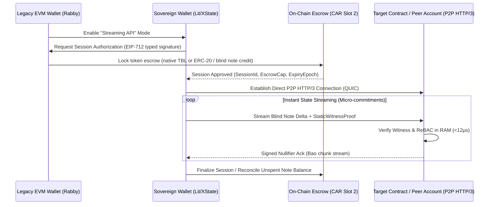

# Sovereign Bunny Stack: Architecture, APIs & Operational Specification

## 1. Overview & Vision

The **Sovereign Bunny Stack** is an entirely stateless, post-quantum resilient, account-lattice ledger engineered for sovereign computing infrastructure. Every participant, process, database, repository, and governance authority is represented as a **first-class Sovereign Actor Account (CAR - Content Addressable Register)**.

Instead of monolithic global block consensus and heavyweight EVM storage matrices, Sovereign Bunny enforces:
1. **Parallel Account Chains**: Accounts advance their own sequence tip independently via blind notes and lattice blocks without global head contention.
2. **Stateless Upfront Witnessing**: State changes are accompanied by Verkle/SMT non-membership proofs and blind notes.
3. **RAM-Speed Zanzibar ReBAC (<12µs)**: Relationship-Based Access Control in Slot 1 evaluated on-the-fly.
4. **O(1) Data-Plane Commitments (DataRef)**: Gigabyte-to-petabyte files (OCI image layers, SQL databases) are committed via 32-byte BLAKE3 roots with Bao verified chunk streaming over Iroh/QUIC.
5. **Software Supply Chain as a Lattice (Repo-as-Account)**: Repositories (such as `k3s-hub`, `sovereign-reth`, and `koral`) are CAR accounts whose commits and interface contracts advance via cryptographic note passing and automated adapter evaluation.

---

## 2. CAR Account Slot Assignment Specification

Every CAR account maintains a 64-slot typed content space. The canonical system slots are assigned as follows:

| Slot Index | Plugin / Name | Data Type & Format | Purpose in Bunny Stack |
|:---|:---|:---|:---|
| **Slot 0** | `core.did_identity` | W3C DID Document Root (CBOR / JSON) | DID identity, controller address, and Dilithium/Falcon Post-Quantum verification keys. |
| **Slot 1** | `core.zanzibar` | Zanzibar ReBAC SMT (Tuple Graph) | Fast in-memory permissions (`owner`, `maintainer`, `depends_on`, `caller_of`). |
| **Slot 2** | `core.native_payment` | Note Balance + Gas Commitment | Blind note values, validator gas subsidy, and economic credits. |
| **Slot 3** | `vcs.git_dag` | Git HEAD OID (`B256`) + Tree Root | Immutable tip of repository state for Git tracking without central hosting. |
| **Slot 4** | `ext.sqldigest` | Schema & Table Poseidon Digest (`B256`) | Relational database schema verification for NextCloud, ERPNext, and Taiga. |
| **Slot 5** | `authority.xroad_descriptor` | X-Road Descriptor (`B256` commitment) | Inter-agency and regulatory trust anchor (X.509 cert hash + security server URI hash). |
| **Slot 6** | `vcs.interface_contract` | Interface Delta Accumulator (`B256`) | Poseidon/Blake3 hash of public API/ABI contracts for automated breaking change detection. |
| **Slot 7** | `reputation.merit` | Soulbound Merit Vector | Non-transferable merit rank used for Snowball validator sampling and governance. |
| **Slot 8–63** | Dynamic / User-Mounted | Custom DataRef or Bytecode | Domain-specific application state (e.g. Zodiac Safe modules, DAO registries). |

---

## 3. Core Engine APIs

### 3.1 Repository Actor Note Passing (`crates/consensus/src/governance/repo_actor.rs`)

When an upstream repository (e.g. `sovereign-reth`) releases an interface change, it emits a `RepoActorNote` to downstream accounts:

```rust
pub struct RepoActorNote {
    pub upstream_repo: Address,
    pub new_upstream_head: B256,
    pub slot3_witness: Bytes,
    pub interface_delta: InterfaceDelta,
    pub is_breaking: bool,
    pub suggested_adapter: Option<Bytes>,
}
```

Downstream accounts evaluate this via:
```rust
let decision = evaluate_repo_actor_note(&note, tests_passed, adapter_available);
match decision {
    RepoActorDecision::AutoAccepted { nullifier } => {
        // Automatically nullify note and advance local Slot 3 & 6
    },
    RepoActorDecision::AutoAdapted { adapter_commit, nullifier } => {
        // Apply synthesis patch and nullify note
    },
    RepoActorDecision::Contention { reason } => {
        // Leave note unspent (corresponds to an open, unmerged PR) and trigger human review
    },
}
```

### 3.2 O(1) DataRef Plane (`crates/consensus/src/lattice/data_ref.rs`)

Multi-gigabyte container images (Koral OCI layers, ERPNext base images) are registered on-chain using 32 bytes:

```rust
pub struct DataRef {
    pub blake3_root: B256,
    pub size_bytes: u64,
    pub seed_node: Option<[u8; 32]>,
    pub namespace: String,
    pub pin_lease_epochs: u64,
}
```

Clients obtain a bearer `ReadTicket` from the Zanzibar Door and stream Bao-verified chunks directly from data pool storage nodes without putting transaction load on the consensus engine.

### 3.3 OpenFGA to Slot 1 CBOR Transcoder (`crates/consensus/src/governance/fga_to_cbor.rs`)

Human-readable authorization DSL:
```text
type repository
  relations
    define committer: [user]
    define merger: [user, actor:ci_runner]
    define depends_on: [repository#release]
```
Compiles deterministically to CBOR bytes and a `B256` commitment hash stored directly in CAR Slot 1.

---

## 4. Operational Setup on Management Server

### 4.1 Synchronizing & Remote Compiling

The codebase is mirrored to `~/sovereign-reth` on the management server.
- **Fast Sync**:
  ```bash
  bash scripts/sync_to_remote.sh
  ```
- **Remote Build & Test**:
  Runs within the persistent tmux session on the remote server:
  ```bash
  cd ~/sovereign-reth && source $HOME/.cargo/env
  cargo test -p sovereign-cluster-tests --lib repo_actor_tests
  ```

### 4.2 ArgoCD & dev-0 Cluster Emulation

1. **Internal Certificate Trust**:
   The internal root certificate (`step-certificates`) is registered in ArgoCD's `argocd-tls-certs-cm` configmap to resolve TLS errors with `https://gitea.mgmt.local`.
2. **dev-0 Namespace**:
   Emulated cluster target inside K3s hosting the Sovereign Bunny container pod, connected to Istio mTLS and monitored via ArgoCD.

---

## 5. Direct P2P HTTP/3 Streaming Sessions & Escrow Architecture

### 5.1 Motivation & Network Model
While standard CAIP-25 and JSON-RPC provide baseline wallet interoperability, high-frequency interaction and instant state transitions benefit from direct **P2P HTTP/3 (QUIC) streams**:
- **Addresses Abstract IPs**: The network layer routes over account addresses (`BgpRouter` / WireGuard / Iroh-QUIC), eliminating static IP dependencies.
- **Multiplexed Bidirectional QUIC Streams**: Low latency, 0-RTT connection resumption, and zero head-of-line blocking.
- **Decoupled Slot Consensus**: The consensus network only agrees on the monotonic **CAR slot architecture** (Slot 0..63) and validity proofs. Individual state updates within streams are decoupled plugins.

### 5.2 Legacy EVM Wallet Streaming Mode (Escrowed Session)
In the Sovereign Wallet, users can toggle the **Streaming API Option** while using a legacy EVM wallet (e.g. Rabby / MetaMask) without requiring native Post-Quantum verification keys:



### 5.3 Technical Invariants
1. **Upfront Escrow Locking**: Opening a streaming session executes a single initial wallet signature locking an agreed spending cap into `Slot 2` (Payment Core) or a dedicated escrow contract.
2. **Sub-millisecond Blind Note Passing**: Micro-transactions, queries, and state deltas within the streaming session travel over unidirectional and bidirectional QUIC data frames as blind note commitments and SSZ/CBOR-encoded payloads.
3. **zkProof Acceleration & E3 Modular Readiness**: State updates paired with Verkle/ZK non-membership proofs execute without on-chain mempool latency. Compatible with future zero-knowledge execution modularities (such as Gnosis Guild E3 / zkEVM enclaves).
4. **User Confirmation Policy**: The wallet tracks total consumed session bandwidth/funds. While state commitments stream rapidly, the UI prompts for user approval if an action exceeds the session threshold or touches a non-whitelisted Zanzibar scope.
