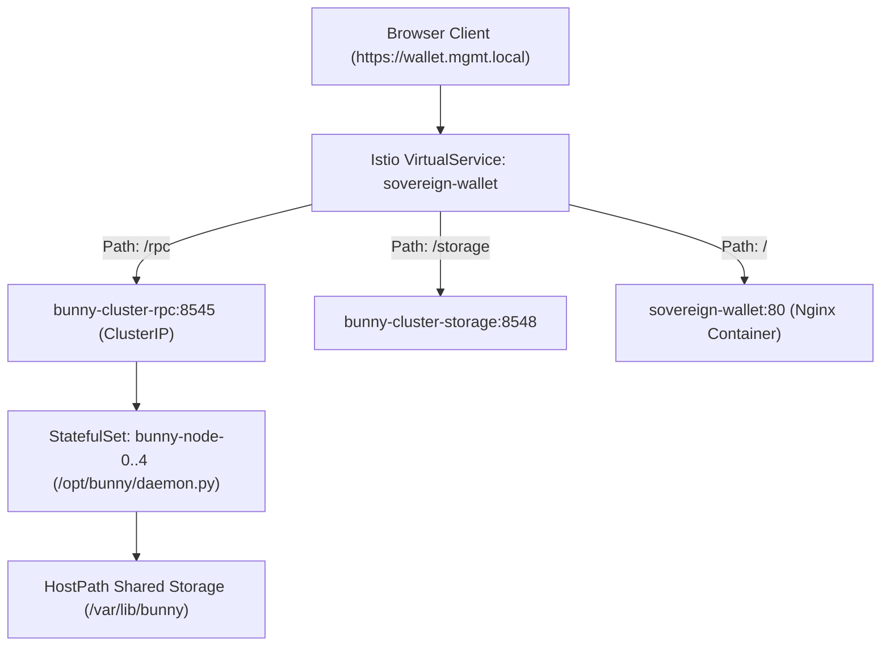

# Sovereign Network Configuration & Environment Reference

This document provides a consolidated reference for all configuration parameters, environment variables, cluster network endpoints, and system precompile addresses across Sovereign Reth, the K3s cluster, and the Sovereign Web Wallet.

---

## 1. Network & Chain Identifiers

| Parameter | Default Value | Cluster / Prod Value | Description |
|---|---|---|---|
| **Chain ID** | `1337` | `1337` | Sovereign Network EVM Chain ID. Used in EIP-155 replay protection and DID documents (`did:sovereign:1337:<addr>`). |
| **Network Name** | `Sovereign Bunny` | `Sovereign Bunny` | Network human-readable label presented to wallets (e.g., Rabby / MetaMask). |
| **Native Ticker** | `TBL` | `TBL` | The Block Lattice currency ticker symbol. Used in balance and fee displays. |
| **Decimals** | `18` | `18` | Base EVM unit precision ($1 \text{ TBL} = 10^{18} \text{ Wei}$). |
| **RPC Endpoint** | `/rpc` | `https://wallet.mgmt.local/rpc` | Canonical JSON-RPC endpoint (routed via Istio to `bunny-cluster-rpc:8545`). |
| **Storage DA Endpoint** | `/storage` | `https://wallet.mgmt.local/storage` | Iroh decentralized content and media storage endpoint. |

---

## 2. Cluster Deployment & Istio Routing

In the Kubernetes / K3s environment (`bunny-cluster` namespace):



### Pod & Service Topology

| Resource | Namespace | Port | Target | Purpose |
|---|---|---|---|---|
| `VirtualService/sovereign-wallet` | `bunny-cluster` | 443 | - | Istio ingress routing for web app, `/rpc`, and `/storage`. |
| `Service/bunny-cluster-rpc` | `bunny-cluster` | 8545 | StatefulSet `bunny-node` | Round-robin load balancer across validator nodes. |
| `StatefulSet/bunny-node` | `bunny-cluster` | 8545 | 5 replicas (`0` to `4`) | Distributed consensus nodes running `/opt/bunny/daemon.py`. |
| `Deployment/sovereign-wallet` | `bunny-cluster` | 80 | Nginx pod | Serves `index.html`, `app_bundle.js`, and `sovereign.config.json`. |
| `ConfigMap/bunny-daemon-script` | `bunny-cluster` | - | Mounted at `/opt/bunny/daemon.py` | Node daemon execution logic and RPC method handlers. |

### Shared Storage Invariants (`/var/lib/bunny/`)

- `dids_registry.json`: Persistent registry of all verified on-chain DIDs and verification methods. Shared across all pod replicas.
- `tx_log.json`: Canonical transaction log capturing on-chain DID registrations, lattice transfers, and contract calls.

---

## 3. Environment Variables

### Validator Node (`bunny-node`)
| Variable | Default | Purpose |
|---|---|---|
| `POD_NAME` | `bunny-node` | Identifies node replica (`bunny-node-0`, etc.) in RPC responses and ActivityPub actor headers. |
| `CHAIN_ID` | `1337` | Network chain identifier. |
| `SOVEREIGN_TICKER` | `TBL` | Display and settlement ticker. |

### Wallet Client Runtime (`sovereign.config.json`)
The wallet frontend dynamically fetches `./sovereign.config.json` at boot:
```json
{
  "networkName": "Sovereign Bunny",
  "chainId": 1337,
  "rpcUrl": "/rpc",
  "storageUrl": "/storage",
  "ticker": "TBL",
  "enclaveCapability": "SimulatedDev"
}
```

---

## 4. System Precompile Directory (EIP-1352 Reserved Range)

Sovereign Reth reserves precompile addresses in the range `0x00...0001` through `0x00...0100`:

| Address | Constant | Interface | Description |
|---|---|---|---|
| `0x00...0001` | `SYSTEM_EPOCH_REGISTRY` | `IRegisterRouter` | Global epoch coordinator & polymorphic slot mounting. |
| `0x00...0002` | `SYSTEM_RECEIVE_HOOK` | `IReceiveHook` | Stateless sweep payments & lattice tip progression. |
| `0x00...0003` | `SYSTEM_DID_REGISTRY` | `IDidRegistry` | W3C DID document registration & Post-Quantum key anchoring (Slot 0). |
| `0x00...0004` | `SYSTEM_SAGA_ESCROW` | `ISagaIntentRouter` | 2-Phase async intent escrow & cross-chain coordination. |
| `0x00...0005` | `SYSTEM_JURISDICTION` | `IJurisdiction` | Quadrant-based regulatory & SMT compliance declarations. |
| `0x00...0006` | `SYSTEM_BRIDGE` | `IBridgeShadow` | L1/L2 shadow anchor receipts. |
| `0x00...0007` | `SYSTEM_ASYNC_INBOX` | `IAsyncInbox` | Asynchronous mailbox dispatch between accounts. |
| `0x00...0008` | `SYSTEM_ZK_COMPLIANCE` | `IZkCompliance` | UltraHonk client-side compliance tickets. |
| `0x00...0053` | `SYSTEM_STORAGE_DA` | `IStorageDA` | Bao outboard tree verification & ZK-PoR. |
| `0x00...0054` | `SYSTEM_SIGNAL_REGISTRY` | `ISignalRegistry` | Address interest signaling in Cuckoo filter. |
| `0x00...0055` | `SYSTEM_SQL_ENGINE` | `ISqlEngine` | Relational SQL digest queries against DAO & contract accounts. |
| `0x00...0061` | `PRECOMPILE_VERIFY_REBAC` | `IZanzibarReBAC` | Google Zanzibar relation-based access control. |
| `0x00...0065` | `SYSTEM_NOTE_REGISTRY` | `INoteRegistry` | Shielded blind note commit & zero-gas absorption. |
| `0x00...00F1` | `SYSTEM_CMS` | `IActivityPubCMS` | W3C ActivityStreams 2.0 federation notes. |
| `0x00...0100` | `SYSTEM_ACCOUNT_HEIGHT` | `ILatticeHeight` | Local account lattice sequence height. |

---

## 5. Wallet Client Security & Execution Modes

The wallet client supports dynamic configuration across 4 execution combinations:

1. **Modern Highway (CAIP-25 + CBOR + HTTP/3)**:
   - In-wallet Post-Quantum signer (ML-DSA-65).
   - Direct binary transmission; no outer classical ECDSA wrapper.
2. **Quantum-Wrapped Envelope (EIP-8141)**:
   - Outer frame: Classical Secp256k1 (signed by Rabby / MetaMask).
   - Inner frame: ML-DSA-65 post-quantum signature.
   - Compatible with legacy browser extensions and hardware wallets without exposing quantum vulnerabilities.
3. **Legacy Pure EVM (Classical Secp256k1)**:
   - Standard EVM transactions for legacy smart contract interactions.
   - Gated by `ALLOW_LEGACY=true` policy flag.
4. **Bare-Metal On-Chain Bytecode**:
   - Direct bytecode dispatch to precompile addresses.
