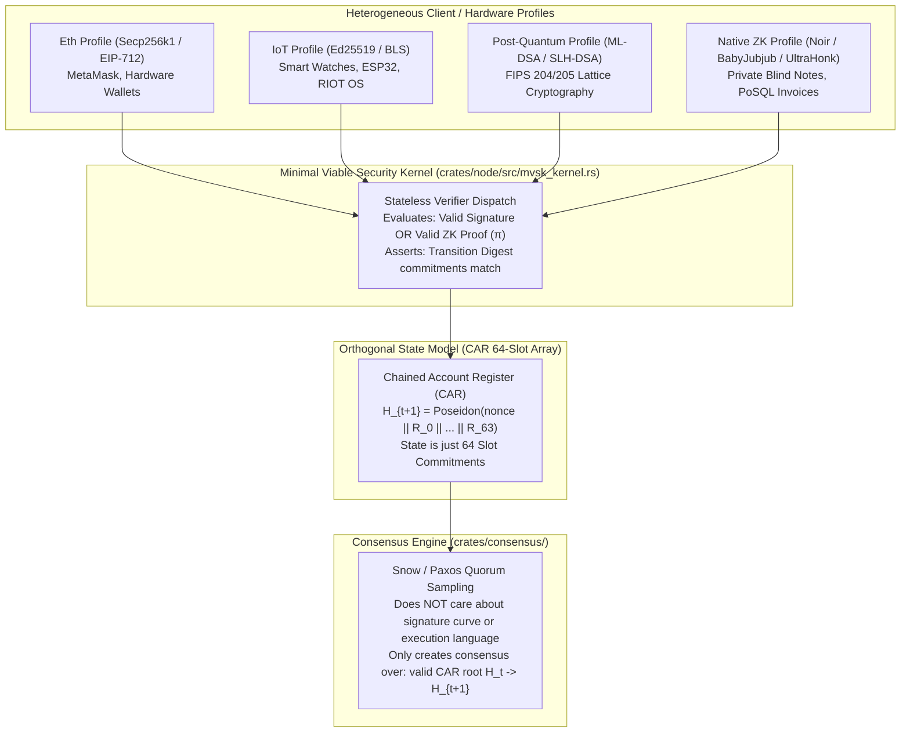

# Sovereign Stack: Polymorphic Cryptographic Architecture & Decoupled Consensus

```mermaid
flowchart TD
    subgraph Ingress["Heterogeneous Client / Hardware Profiles"]
        P1["Eth Profile (Secp256k1 / EIP-712)\nMetaMask, Hardware Wallets"]
        P2["IoT Profile (Ed25519 / BLS)\nSmart Watches, ESP32, RIOT OS"]
        P3["Post-Quantum Profile (ML-DSA / SLH-DSA)\nFIPS 204/205 Lattice Cryptography"]
        P4["Native ZK Profile (Noir / BabyJubjub / UltraHonk)\nPrivate Blind Notes, PoSQL Invoices"]
    end

    subgraph MVSK["Minimal Viable Security Kernel (crates/node/src/mvsk_kernel.rs)"]
        Verify["Stateless Verifier Dispatch\nEvaluates: Valid Signature OR Valid ZK Proof (π)\nAsserts: Transition Digest commitments match"]
    end

    subgraph State["Orthogonal State Model (CAR 64-Slot Array)"]
        CAR["Chained Account Register (CAR)\nH_{t+1} = Poseidon(nonce || R_0 || ... || R_63)\nState is just 64 Slot Commitments"]
    end

    subgraph Consensus["Consensus Engine (crates/consensus/)"]
        Snow["Snow / Paxos Quorum Sampling\nDoes NOT care about signature curve or execution language\nOnly creates consensus over: valid CAR root H_t -> H_{t+1}"]
    end

    P1 --> Verify
    P2 --> Verify
    P3 --> Verify
    P4 --> Verify
    Verify --> CAR
    CAR --> Snow
```

